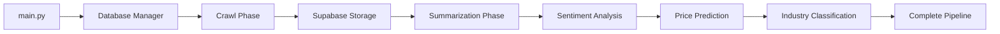

# 🚀 SPA VIP - INTEGRATED NEWS PROCESSING SYSTEM

Hệ thống xử lý tin tức tự động hoàn chỉnh từ crawl đến tóm tắt AI với kiến trúc tập trung.

## 📁 Cấu trúc dự án (CẬP NHẬT)

```
SPA_vip/
├── 📁 crawl/                          # Hệ thống crawl tin tức
│   ├── main_crawl.py                  # Controller chính
│   ├── crawlers/                      # Các crawler cụ thể
│   ├── config/                        # Cấu hình crawler cũ (deprecated)
│   └── crawl_stock/                   # Crawler giá cổ phiếu
│
├── 📁 summarization/                  # Hệ thống tóm tắt AI
│   ├── main_summarization.py         # Pipeline tóm tắt
│   ├── models/                        # Python modules (không có model weights)
│   ├── database/                      # Handler cũ (deprecated)
│   └── utils/                         # Utilities
│
├── 📁 sentiment/                      # Hệ thống phân tích sentiment
│   ├── predict_sentiment_db.py        # Dự đoán sentiment
│   ├── optimized_sentiment_update.py  # Cập nhật sentiment tối ưu
│   └── thongke_sentiment_day_db.py    # Thống kê sentiment theo ngày
│
├── 📁 timeseries/                     # Hệ thống dự đoán giá cổ phiếu
│   ├── main_timeseries.py             # Controller dự đoán
│   └── load_model_timeseries_db.py    # Load model LSTM
│
├── 📁 industry/ 🆕                    # ✨ HỆ THỐNG PHÂN LOẠI NGÀNH (MỚI)
│   ├── main.py                        # Controller phân loại ngành
│   ├── pipeline/                      # Pipeline xử lý
│   ├── models/                        # PhoBERT classifier
│   └── utils/                         # Database utilities
│
├── 📁 model_AI/ 🆕                    # ✨ TẤT CẢ AI MODELS (KHÔNG PUSH LÊN GIT)
│   ├── sentiment_model/               # PhoBERT cho phân tích sentiment
│   │   └── Phobert_hyper_parameters/  # Model weights + training files
│   ├── summarization_model/           # ViT5 cho tóm tắt tin tức
│   │   └── model_vit5/               # Model weights + config files
│   ├── timeseries_model/             # LSTM cho dự đoán giá
│   │   └── model_lstm/               # Model weights + training files
│   ├── industry_model/               # PhoBERT cho phân loại ngành
│   │   └── PhoBERT_summary_industry.bin # Model weights
│   └── README.md                     # Hướng dẫn về các models
│
├── 📁 database/                       # ✨ HỆ THỐNG DATABASE TẬP TRUNG (MỚI)
│   ├── __init__.py                    # Package initialization
│   ├── config.py                      # Cấu hình database
│   ├── supabase_manager.py            # Manager chính
│   ├── schemas.py                     # Data schemas
│   ├── test_connection.py             # Test connection
│   └── README.md                      # Documentation
│
├── main.py                            # ✨ CONTROLLER CHÍNH (MỚI)
├── logs/                              # Log files tổng hợp
├── .gitignore                         # Loại trừ model_AI/ khỏi Git
└── README.md                          # File này
```

## 🎯 Tính năng chính

### ✅ HỆ THỐNG CRAWL (`crawl/`)
- **Multi-source crawling**: FireAnt, CafeF, ChungTa, Simplize
- **Smart deduplication**: Tránh crawl trùng lặp
- **Multiple stock codes**: FPT, GAS, IMP, VCB
- **Structured data**: Lưu vào Supabase với schema chuẩn

### ✅ HỆ THỐNG TÓM TẮT (`summarization/`)
- **AI-powered**: Sử dụng ViT5 fine-tuned cho tiếng Việt
- **Batch processing**: Xử lý hiệu quả nhiều bài cùng lúc
- **GPU/CPU support**: Tự động tối ưu theo hardware
- **Table-specific**: Có thể xử lý từng bảng riêng biệt

### ✅ HỆ THỐNG PHÂN TÍCH SENTIMENT (`sentiment/`) - MỚI 🌟
- **PhoBERT model**: Sử dụng PhoBERT fine-tuned cho sentiment tiếng Việt
- **3-class classification**: Positive, Negative, Neutral
- **Optimized processing**: Xử lý tối ưu cho ngày giao dịch
- **Real-time analysis**: Phân tích sentiment realtime

### ✅ HỆ THỐNG DỰ ĐOÁN GIÁ (`timeseries/`) - MỚI 🌟  
- **LSTM model**: Sử dụng LSTM cho dự đoán giá cổ phiếu
- **15-day window**: Dự đoán dựa trên 15 ngày dữ liệu lịch sử
- **Multi-stock support**: Hỗ trợ nhiều mã cổ phiếu
- **Database integration**: Tích hợp với database tập trung

### ✅ HỆ THỐNG PHÂN LOẠI NGÀNH (`industry/`) - MỚI 🌟
- **PhoBERT model**: Sử dụng PhoBERT fine-tuned cho phân loại ngành
- **5-class classification**: Finance, Technology, Healthcare, Energy, Other
- **Smart processing**: Xử lý dựa trên ai_summary hoặc content
- **Batch processing**: Xử lý hiệu quả nhiều bài cùng lúc

### ✅ HỆ THỐNG AI MODELS (`model_AI/`) - MỚI 🌟
- **Centralized storage**: Tất cả AI models ở một nơi
- **Git-ignored**: Không push lên GitHub do kích thước lớn
- **Organized structure**: Phân chia theo từng module rõ ràng
- **Easy deployment**: Dễ dàng deploy và quản lý models

### ✅ HỆ THỐNG DATABASE TẬP TRUNG (`database/`) - MỚI 🌟
- **Centralized config**: Cấu hình database tập trung
- **Schema validation**: Validation dữ liệu tự động
- **Error handling**: Xử lý lỗi toàn diện
- **Connection management**: Quản lý kết nối tự động
- **Statistics**: Built-in monitoring và báo cáo

### ✅ CONTROLLER CHÍNH (`main.py`) - MỚI 🌟
- **Unified interface**: Giao diện duy nhất cho toàn bộ hệ thống
- **Pipeline orchestration**: Điều phối crawl → summarization
- **Advanced options**: Flexible configuration
- **Comprehensive logging**: Log tập trung với monitoring
- **Error recovery**: Xử lý lỗi và recovery tự động

## 🚀 Cách sử dụng (CẬP NHẬT)

### 🔧 Setup ban đầu

1. **Install dependencies**:
   ```bash
   # Database dependencies
   pip install -r database/requirements.txt
   
   # Crawl dependencies  
   cd crawl && pip install -r requirements.txt && cd ..
   
   # Summarization dependencies
   cd summarization && pip install -r requirements.txt && cd ..
   ```

2. **Test kết nối database**:
   ```bash
   python database/test_connection.py
   ```

3. **🔧 Cấu hình Database (Nếu cần thay đổi)**:
   
   **Để thay đổi Supabase URL/KEY của bạn:**
   
   ```bash
   # Tạo file .env từ template
   copy .env.example .env
   
   # Hoặc tạo file .env mới với nội dung:
   ```
   
   **File `.env`**:
   ```env
   # Thay đổi URL và KEY theo database của bạn
   SUPABASE_URL=https://your-project-id.supabase.co
   SUPABASE_KEY=your_supabase_anon_key_here
   ```
   
   **📝 Lưu ý**: 
   - File `.env` sẽ override các giá trị default trong `database/config.py`
   - Không commit file `.env` lên Git (đã có trong .gitignore)
   - Mỗi thành viên có thể có database riêng

4. **⚠️ QUAN TRỌNG: Chuẩn bị AI Models**
   ```bash
   # Tạo folder model_AI nếu chưa có
   mkdir model_AI
   ```
   
   **📥 TẢI MODELS TỪ GOOGLE DRIVE:**
   
   🔗 **Link tải models**: https://drive.google.com/drive/folders/1RctDhes_yJkdLtzqnEIZoHERxW-eaFKS?usp=drive_link
   
   **Cấu trúc sau khi tải về và giải nén:**
   ```
   model_AI/
   ├── sentiment_model/
   │   └── Phobert_hyper_parameters/
   │       └── PhoBERT_summary_sentiment_optuna.bin
   ├── summarization_model/
   │   └── model_vit5/
   │       ├── model.safetensors
   │       ├── config.json
   │       ├── tokenizer_config.json
   │       └── ... (các file khác)
   └── timeseries_model/
       └── model_lstm/
           └── LSTM_missing10_window15.keras
   ```
   
   **📝 Lưu ý**: Do models có kích thước lớn (>100MB), chúng không được push lên Git. 
   Các thành viên nhóm **BẮT BUỘC** phải tải models từ Google Drive và đặt vào đúng cấu trúc.

### 🚀 Chạy hệ thống (MỚI)

#### **🎯 RECOMMENDED: Full Pipeline**
```bash
python main.py --full                    # Chạy toàn bộ: crawl → summarization
python main.py --full --summ-priority    # Full pipeline với priority processing
```

#### **📊 Monitoring & Status**
```bash
python main.py --status                  # Xem trạng thái hệ thống
python main.py                          # Xem usage và trạng thái
```

#### **🗞️ Chỉ crawling**
```bash
python main.py --crawl-only              # Chạy tất cả crawler
python main.py --crawl-only --crawl-single fireant_fpt  # Chỉ crawler FPT
```

#### **🤖 Chỉ summarization**
```bash
python main.py --summarize-only          # Xử lý tất cả bảng
python main.py --summarize-only --summ-table FPT_News   # Chỉ bảng FPT
python main.py --summarize-only --summ-priority         # Theo priority
```

#### **💭 Chỉ phân tích sentiment**
```bash
python sentiment/predict_sentiment_db.py              # Phân tích sentiment cho tất cả
python sentiment/optimized_sentiment_update.py        # Cập nhật sentiment tối ưu
```

#### **📈 Chỉ dự đoán giá cổ phiếu**
```bash
python timeseries/main_timeseries.py --stock FPT       # Dự đoán giá FPT
python timeseries/main_timeseries.py --all             # Dự đoán tất cả cổ phiếu
```

#### **🏭 Chỉ phân loại ngành công nghiệp**
```bash
python main.py --industry-only                        # Phân loại tất cả bảng
python main.py --industry-only --ind-tables FPT_News  # Chỉ bảng FPT
python main.py --industry-only --ind-batch-size 100   # Batch size tùy chỉnh
```

### 🎛️ Advanced Options

```bash
# Combinations
python main.py --full --crawl-single fireant_fpt --summ-table FPT_News
python main.py --full --summ-priority

# Help
python main.py --help
```

## 📊 Database Schema (Chuẩn hóa)

### Tables tin tức:
- `FPT_News`, `GAS_News`, `IMP_News`, `VCB_News`: Tin tức theo từng mã cổ phiếu
- `General_News`: Tin tức chung

### Tables giá cổ phiếu:
- `FPT_Stock`, `GAS_Stock`, `IMP_Stock`, `VCB_Stock`: Dữ liệu giá và sentiment

### Cấu trúc bảng News:
```sql
CREATE TABLE <STOCK>_News (
    id bigint PRIMARY KEY,
    title text NOT NULL,
    content text NOT NULL,
    date date NOT NULL,
    link text UNIQUE NOT NULL,
    ai_summary text,     -- Được điền bởi summarization
    sentiment text,      -- Được điền bởi sentiment analysis
    industry text        -- Được điền bởi industry classification
);
```

### Cấu trúc bảng Stock:
```sql
CREATE TABLE <STOCK>_Stock (
    id bigint PRIMARY KEY,
    date date NOT NULL,
    open numeric,
    high numeric,
    low numeric,
    close numeric,
    volume bigint,
    positive integer DEFAULT 0,    -- Số tin tích cực
    negative integer DEFAULT 0,    -- Số tin tiêu cực  
    neutral integer DEFAULT 0,     -- Số tin trung tính
    predicted_price numeric        -- Giá dự đoán từ LSTM
);
```

## 🔄 Workflow mới (Tối ưu)



1. **Initialization**: `main.py` khởi tạo database manager tập trung
2. **Crawl Phase**: Thu thập tin tức từ các nguồn → Supabase
3. **Wait Period**: 10 giây nghỉ giữa các phase
4. **Summarization Phase**: AI tạo tóm tắt cho articles chưa có
5. **Sentiment Analysis**: PhoBERT phân tích sentiment cho tin tức
6. **Price Prediction**: LSTM dự đoán giá cổ phiếu dựa trên dữ liệu lịch sử
7. **Industry Classification**: PhoBERT phân loại tin tức theo ngành công nghiệp
8. **Monitoring**: Báo cáo tổng kết và statistics

## 📈 Performance hiện tại

### **System Status:**
- **Total Articles**: 1,037
- **AI Summarized**: 1,035 (99.8%)
- **Sentiment Analyzed**: ~1,000+ articles
- **Price Predictions**: Daily predictions cho 4 mã cổ phiếu
- **Pending**: 2 articles

### **Table Breakdown:**
- **General_News**: 331/331 (100.0%)
- **FPT_News**: 434/436 (99.5%)
- **GAS_News**: 74/74 (100.0%)
- **IMP_News**: 96/96 (100.0%)
- **VCB_News**: 100/100 (100.0%)

### **Processing Speed:**
- **Crawling**: ~100-200 articles/hour
- **GPU Summarization**: ~300-500 articles/hour
- **CPU Summarization**: ~100-200 articles/hour
- **Sentiment Analysis**: ~500-1000 articles/hour
- **Price Prediction**: ~4 stocks/minute

## 🛠️ Troubleshooting (Cập nhật)

### Lỗi database connection
```bash
python database/test_connection.py       # Test connection

# Nếu muốn thay đổi database, tạo file .env:
# SUPABASE_URL=https://your-project-id.supabase.co
# SUPABASE_KEY=your_supabase_anon_key_here
```

### Lỗi AI models không tìm thấy
```bash
# Kiểm tra models có tồn tại không:
ls model_AI/sentiment_model/Phobert_hyper_parameters/
ls model_AI/summarization_model/model_vit5/
ls model_AI/timeseries_model/model_lstm/

# Nếu thiếu models, tải từ Google Drive:
# https://drive.google.com/drive/folders/1RctDhes_yJkdLtzqnEIZoHERxW-eaFKS?usp=drive_link
```

### Lỗi import hoặc missing dependencies
```bash
pip install -r database/requirements.txt
pip install -r crawl/requirements.txt
pip install -r summarization/requirements.txt
```

### Out of memory (Summarization)
- Giảm `BATCH_SIZE` trong summarization config
- Chuyển từ GPU sang CPU mode

### Lỗi crawl
```bash
python main.py --crawl-only --crawl-single fireant_fpt  # Test single crawler
```

### Lỗi sentiment analysis
```bash
python sentiment/predict_sentiment_db.py --test  # Test sentiment model
```

### Lỗi price prediction  
```bash
python timeseries/load_model_timeseries_db.py    # Test LSTM model
```

## 🎯 Mở rộng tương lai

- [x] **Centralized Database**: ✅ Hoàn thành
- [x] **Unified Controller**: ✅ Hoàn thành
- [x] **Advanced CLI**: ✅ Hoàn thành
- [x] **Sentiment Analysis**: ✅ Hoàn thành - PhoBERT phân tích sentiment
- [x] **Price Prediction**: ✅ Hoàn thành - LSTM dự đoán giá cổ phiếu
- [x] **Model Organization**: ✅ Hoàn thành - Tổ chức models trong model_AI/
- [ ] **Real-time Processing**: Xử lý real-time
- [ ] **Web Dashboard**: Dashboard monitoring
- [ ] **REST API**: API cho external integration
- [ ] **Docker Support**: Containerization
- [ ] **Automated Scheduling**: Cron jobs
- [ ] **Advanced Analytics**: Phân tích sâu hơn sentiment vs price correlation

## 📞 Support

### Quick Commands:
```bash
python main.py --status                  # Kiểm tra trạng thái
python database/test_connection.py       # Test database
python main.py --help                    # Xem help
```

### Database Configuration:
```bash
# Để thay đổi database của bạn:
copy .env.example .env                   # Tạo file .env
# Sửa SUPABASE_URL và SUPABASE_KEY trong .env
python database/test_connection.py       # Test connection
```

📖 **Chi tiết**: Xem `database/DATABASE_CONFIG.md`

### Workflow Testing:
```bash
python main.py --crawl-only              # Test crawling
python main.py --summarize-only          # Test summarization  
python sentiment/predict_sentiment_db.py # Test sentiment analysis
python timeseries/main_timeseries.py     # Test price prediction
python main.py --full                    # Test full pipeline
```

### Model Testing:
```bash
# Kiểm tra các models có hoạt động không
python -c "import torch; print('PyTorch:', torch.__version__)"
python -c "from transformers import T5Tokenizer; print('Transformers OK')"
python -c "import tensorflow as tf; print('TensorFlow:', tf.__version__)"
```

### 📂 Cấu trúc model_AI cần thiết:
```
model_AI/
├── sentiment_model/Phobert_hyper_parameters/PhoBERT_summary_sentiment_optuna.bin
├── summarization_model/model_vit5/model.safetensors  
└── timeseries_model/model_lstm/LSTM_missing10_window15.keras
```

### 📥 TẢI MODELS:
**Google Drive**: https://drive.google.com/drive/folders/1RctDhes_yJkdLtzqnEIZoHERxW-eaFKS?usp=drive_link

**Hướng dẫn**:
1. Tải toàn bộ folder từ Google Drive
2. Giải nén và đặt vào đúng cấu trúc `model_AI/`
3. Chạy lệnh test để kiểm tra

---

**🎉 Hệ thống hoàn chỉnh với 4 modules chính: Crawling → Summarization → Sentiment Analysis → Price Prediction!**

**⚠️ HƯỚNG DẪN CHO TEAM**:
1. **Tải models**: https://drive.google.com/drive/folders/1RctDhes_yJkdLtzqnEIZoHERxW-eaFKS?usp=drive_link
2. **Đặt vào folder** `model_AI/` theo đúng cấu trúc
3. **Test trước khi chạy**: `python main.py --status`
